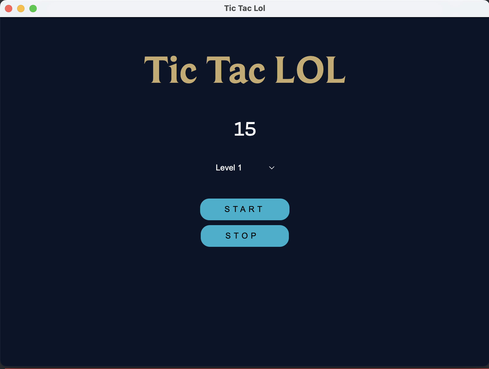

# Tic..Tac...LOL ⏰

A program that remind you to check your map on League of legends.  
Inspired by the video of [sididi](https://www.youtube.com/watch?v=Q3GGIp9K3wM)

## Why ?

I was trying to improve at league of legends and after visioning this [video](https://www.youtube.com/watch?v=Q3GGIp9K3wM)  
i started train to check my map every 15sec with another random video on youtube who make a beep every 15 seconds  
but there was multiple problem:

- The videos i found stopped after 30min so if the game was too long i have to alt tab and replay
- It was annoying each time to search for the video before each sessions
- In [sididi](https://www.youtube.com/watch?v=Q3GGIp9K3wM) he say to start with a 15 seconds reminder then 10 and 5 at the end  
i have to find 3 video with a beep with these interval ? Really annoying 🤔 (Yeah i'm a really lazy person)

## Quickstart

The program is available [here](https://github.com/macrespo42/tic-tac-lol/releases/tag/1.0.0)  
its currently available on Windows and Macos. (If someone need it for another platform since its an electron app just ask me and i can make it available)

Once installed the application should look like this:



You've got 3 level available:

- level 1: beep every 15 seconds
- level 2: beep every 10 seconds
- level 3: beep every 5 seconds

## 🤝 Contributing

### Clone the repo

```bash
git clone https://github.com/macrespo42/tic-tac-lol
cd tic-tac-lol
```

### Run the project

```bash
npm run start
```

### Submit a pull request

If you'd like to contribute, please fork the repository and open a pull request to the `main` branch.
